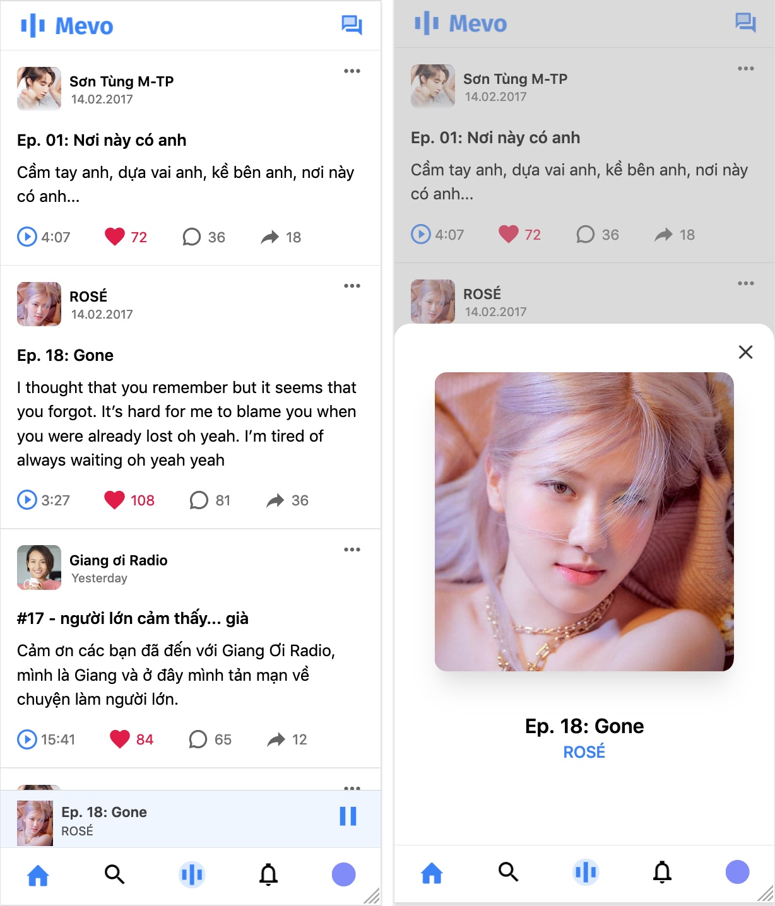

# Welcom to MOVE - the podcast social network you love!

> - This project is in development. So there are a lot of features that may not work yet. We're trying to finish them soon
> - Currently we only make for mobile screen, so please view the site in responsive mode, or just view it on your phone. 



## Setup

```shell
git clone https://github.com/nhhao/mevo-client.git
cd mevo-client
yarn # or npm install
```

## Development

```shell
yarn dev
```

Start the development server on http://localhost:3000. You can also open it on another device (such as a phone) at http://<your-ip-address>:3000, as long as this device has the same connection to the development server.
